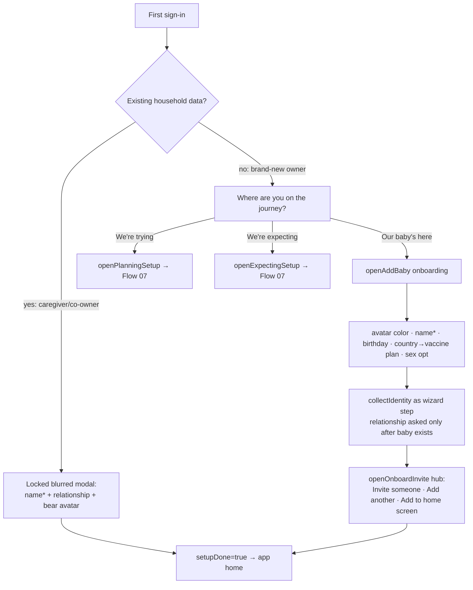

# Flow 02 — First-run onboarding

**Status: ✅ shipped · 1 P1 structural gap (G1 wizard order)** · Files: `app/index.html` (renderOnboard ~3633, openAddBaby ~2687), `app/store-firebase.js` (maybeFirstRun 1174–1235)

## Entry points
- First successful sign-in ever (new household owner, no baby, no pregnancy) → `renderOnboard()` stage chooser.
- Invited caregiver's first sign-in (household already has data) → `openFirstRun()` locked identity modal.
- Any member with `memberInfo[uid].setupDone !== true`.

## Flow diagram

## Break points
| Condition | Behavior | Ref |
|---|---|---|
| Modal dismissal | Locked (`{locked:true, blur:true}`), only exits = Save or Log out | store-firebase.js:1188 |
| Baby name missing | Save blocked (required field) | index.html:2687+ |
| Country | Defaults via `detectCountry()`, sets vaccine schedule | index.html:2687+ |
| Pregnancy path | Invite hub shows circle-only variant (no "add another") | index.html:2733 |
| Re-trigger | Never: gated on `setupDone` | store-firebase.js:1179 |

## Expected vs actual
| Expected (source) | Actual | Status |
|---|---|---|
| Non-dismissible locked first-run modal, name required (README §5) | As specced | ✅ |
| Stage chooser trying/expecting/baby ("start wherever you are", PREGNANCY-HANDOFF-V2) | 3 tiles + twins support (v0.14.0) | ✅ |
| **One ordered wizard**: stage → member setup → install (UX-ROADMAP **G1**, "DO FIRST") | Identity modal can fire *over* the stage question; v0.14.0 "2-state onboarding" may have partially fixed — roadmap (06-22) still lists G1 open | ⚠️ open, verify |
| Home "Get started" checklist (ONBOARDING recommended build) | Not found in code | ❌ planned |
| Sign-in value strip, 3 bullets (ONBOARDING) | Not found | ❌ planned |
| Beta copy self-graduates after 2026-07-27 (HANDOFF) | Inline date check present; trigger in 15 days | ✅ pending trigger |

## Open items
G1 (wizard order — verify against current build, then close or fix), onboarding checklist + value strip (planned, P2).
