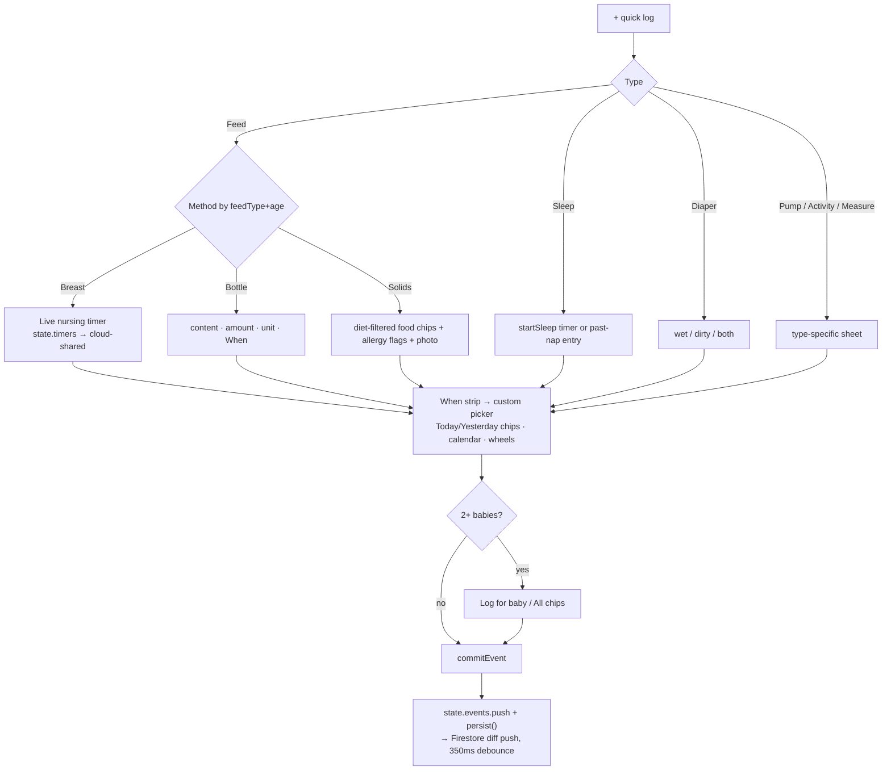
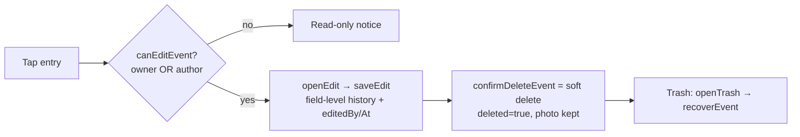

# Flow 03 — Core logging

**Status: ✅ shipped, rich · 2 P1 interaction bugs (C1, C2)** · Files: `app/index.html` (quick-log 2223–2660), `app/cubby-extras.js` (When pickers 235–330), `app/voice-log.js`

## Entry points
- Floating **+** button (home view only — index.html:1326) → `openQuickLog()` grid: Feed / Sleep / Diaper / Pump / Measure / Activity / Say it (voice ✨).
- Live timer banners on home (`timerBanner`/`sinceCard`, ticks every second).
- Rituals tab tick (writes a real authored log event).
- Edit from any timeline entry.

## Flow diagram

## Edit / delete / recover

## Break points
| Condition | Behavior | Ref |
|---|---|---|
| Switching nav tab with sheet open | **Sheet stays on top** — `go(v)` never calls `closeSheet()` | UX-ROADMAP **C1** (P1) |
| Tapping scrim mid-draft | **Draft silently discarded**, no warning ("3am case") | UX-ROADMAP **C2** (P1) |
| Ongoing timer, second phone | Timers sync via cloud blob → nap-in-progress visible everywhere | store-firebase.js:475,498 |
| Future date | Disabled in calendar picker | cubby-extras.js:235–294 |
| Native time inputs | Globally intercepted, replaced with custom pickers | cubby-extras.js:312–323 |
| Voice log | Pro taster: 5 free uses (`PRO_TASTE.voice`) | voice-log.js:192 |
| Soft delete | No undo toast — Trash only | UX-ROADMAP C3 (P2) |

## Expected vs actual
| Expected (source) | Actual | Status |
|---|---|---|
| One shared time strip everywhere (README §5) | `timeStrip`/`getWhen` used by all types | ✅ |
| Everything editable, backdatable, undoable (CHARTER) | Edit+backdate ✅; undo = Trash recovery, no toast | ⚠️ C3 |
| Roles: caregiver edits own only, owner edits all (README §4) | `canEditEvent` + firestore.rules | ✅ |
| Attribution "logged by" + mini bear (README §5) | `authorTag`/`loggerName`, tombstone for ex-members | ✅ |
| Rituals: non-judgmental weekly dots, no streaks (ROUTINES, v0.15.0) | Shipped; data key still `b.routines` | ✅ |
| Multi-baby "log for All" (v0.14.0 twins) | `targetsResolved()` fan-out | ✅ |
| Quick-log + on all views (UX-ROADMAP C6) | Home only | ❌ planned |

## Open items
C1, C2 (P1 — small fixes, big 3am impact), C3 undo toast, C6 + everywhere, C4 scroll cache, C5 view-only labels, C7 empty-state CTAs (P2).
