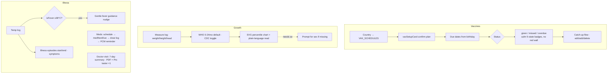

# Flow 04 — Health, growth, vaccines, milestones, photos

**Status: ✅ shipped** · Files: `app/index.html` (illness 5455–5748, growth 5759–6008, vaccines 6039–6229, milestones 6644–6724, journey 6250–6632, photos/studio 6725–8600), `app/growth-data.js`, `app/milestone-data.js`

## Entry points
Health tab (+ nav), baby profile, home cards (fever nudge, vaccine heads-up), quick-log Measure, journey/moment cards.

## Sub-flows

## Break points
| Condition | Behavior | Ref |
|---|---|---|
| No sex set | Percentiles unavailable; legacy 'male/female' vs 'M/F' normalized defensively | index.html:5815 |
| Photo >990 kB | Not synced (Firestore 1 MiB doc cap); user told it stays on-device | store-firebase.js:1056 |
| Overdue vaccine | Calm badge + kind next step (charter: "red is earned") — old OVERDUE wall retired v0.11.0 | ✅ charter example |
| Doctor PDF | `useTaste('pdf')` — 1 free, then Pro sheet | index.html:5634 |
| Milestones | 225 entries: 88 clinical ("around now, most babies"), 137 delight; never a scorecard | MILESTONE-data + MILESTONES.md |

## Expected vs actual
| Expected (source) | Actual | Status |
|---|---|---|
| Country vaccine schedule + reminders free forever (PAYWALL guardrails) | Free, no gate | ✅ |
| WHO+CDC toggle, percentile readout (README §5) | Shipped | ✅ |
| Medicine-only push, quiet hours, never feeds (README §9 + v0.14.0) | Worker cron + FCM; client precomputes 36h `push.due` | ✅ (contradicts stale README "in-app only" — doc issue) |
| Photos as ~560px base64 thumbnails in Firestore, no Blaze (README §3) | `PhotoStore` → `photos/{id}` docs | ✅ |
| On-device-only photo AI, never third-party upload (PAYWALL notes) | Histogram enhance + MediaPipe cutout, lazy-loaded | ✅ |
| Keepsake studio: share cards, monthly cards, birth poster, Then&Now, collage | All present; premium bits Pro-gated with tasters | ✅ |
