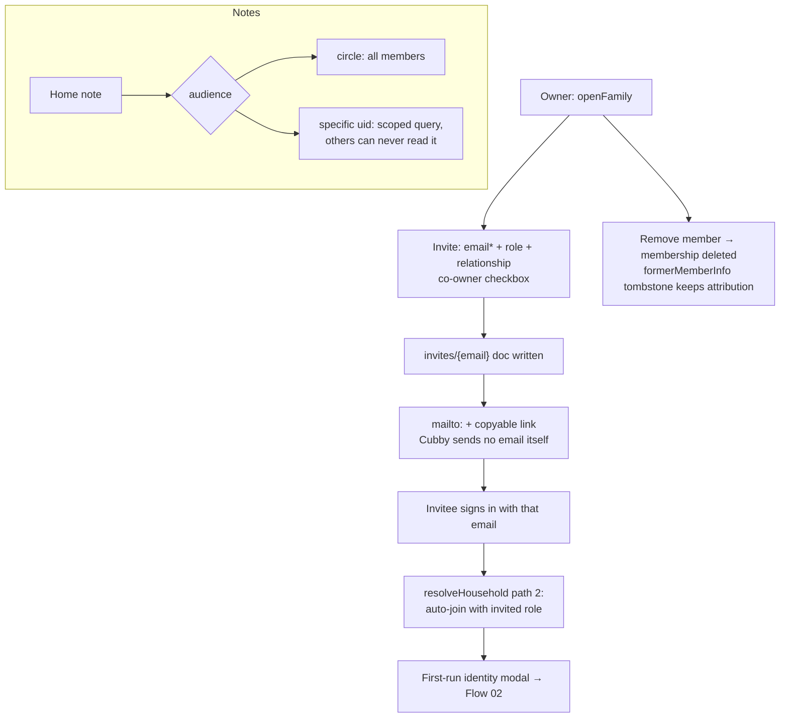

# Flow 05 — Sharing, family & household

**Status: ✅ shipped (the wedge) · sharing-loop leaks open (S1–S6)** · Files: `app/store-firebase.js` (model 688–709, family UI 1117–1310, notes 777–896)

## Model
One `households/{hid}` doc: `members` (uid→owner|caregiver), `memberInfo` (name/relationship/avatar/setupDone), `app` blob, `pro`. Real-time `onSnapshot`. Events per-doc (no clobber); app blob last-write-wins.

## Flow diagram

## Break points
| Condition | Behavior | Ref |
|---|---|---|
| Non-owner invites | "Only an owner can invite" | store-firebase.js:1150 |
| Invitee uses different email | No auto-join — silent miss (invite keyed on lowercased email) | store-firebase.js:404 |
| Member removed | Past entries stay attributed via tombstone | store-firebase.js:1237 |
| Timers/theme/activeBaby | Per-device (localStorage), not synced | store-firebase.js:11 |
| Member emails | **Circle-visible** via memberInfo (known gap, copy corrected; rules fix open) | PRIVACY-MAX known gaps |

## Expected vs actual
| Expected (source) | Actual | Status |
|---|---|---|
| Unlimited caregivers free forever — the wedge (PAYWALL, DESIGN #2) | No gate anywhere | ✅ |
| Invite by email, roles, remove (README §5) | Shipped | ✅ |
| Private notes never readable by others (README §3) | 3 scoped queries + rules | ✅ |
| Referral `?ref=` loop (README §5) | Capture→attribute shipped; **reward not live, unannounced** | ⚠️ planned |
| Native share on invite/guess-game/guest page (UX-ROADMAP S1–S6) | Clipboard-only; `/g/` guest page dead-ends the loop | ❌ open |
| Games hub: `/g/{code}`, guests no account, owner-only reveal, 300-guess cap (GAMES-HUB-SPEC) | Shipped Phase 1; "coming soon" fallback if hub API absent | ✅ (verify `/api/hub` deployed) |

## Open items
**SEC-3 (P0, live): invitee can join as `owner` — rules never check the role value at join; see RULES-REVIEW.md.** Then: S1 (native share, guess link), S2 (share on `/g/`), S3–S6, email-visibility rules fix (PRIV-2), pre-join read exposure (PRIV-4), referral reward launch.
