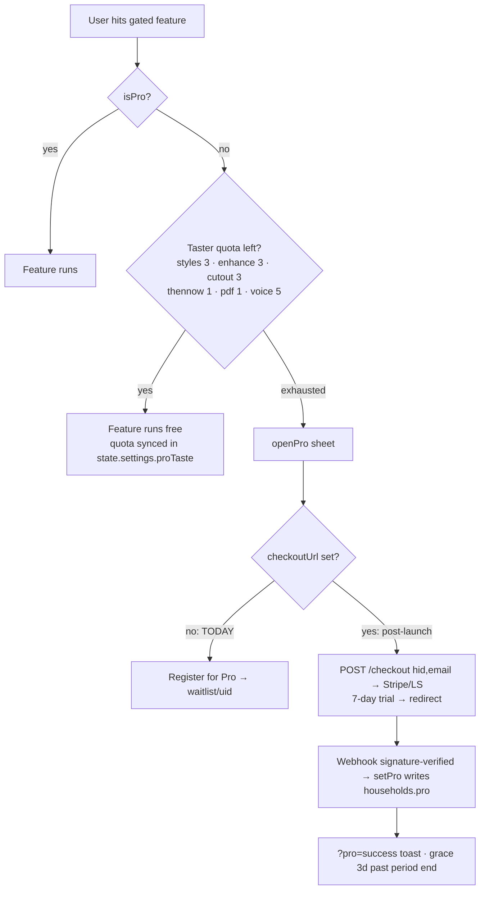

# Flow 06 — Pro paywall & billing

**Status: ⚠️ waitlist mode by design (launch Aug 2026) · 2 security findings · provider decision drift** · Files: `app/index.html` (PRO_CFG 2895, gates 2906–3003), `workers/pro-billing/worker.js` (Stripe), `worker-lemonsqueezy.js` (built, not live)

## Current truth
- `PRO_CFG.checkoutUrl` / `portalUrl` = `""` → every Pro CTA lands on the **waitlist** (`waitlist/{uid}`). `PRO_LAUNCH='August 2026'`.
- Pricing: **one tier, $9/mo · $90/yr**, 7-day trial (source of truth: `CUR` in `pricing/index.html`).
- Entitlement: `households/{hid}.pro` written **only** by the billing worker; `firestore.rules` rejects client writes; `isPro()` = trialing|active|past_due + 3-day grace; dev override `localStorage['cubby-pro-dev']`.

## Flow diagram

## Gates (all zero-marginal-cost)
Portrait/Story formats, premium fonts/palettes/templates/stickers (`proLocked`), auto-enhance, cutout, Then&Now, watermark-free shares, doctor PDF, voice logging, premium export.
**Never gated:** logging, sharing, vaccines, growth, pregnancy core, ≥1 free share format.

## Break points & security
| Finding | Detail | Severity |
|---|---|---|
| **`/portal` IDOR** | Caller supplies `customer`/`subId` with only format+Origin checks — no ownership proof. Forged Origin outside a browser + a valid `cus_…` id ⇒ someone else's billing portal (cancel, card, invoices). Both workers. Fix: bind to verified Firebase ID token like the games hub does. | 🔴 HIGH (pre-launch — fix before flipping checkoutUrl) |
| **`/checkout` unauthenticated `hid`** | Anyone can start checkout crediting an arbitrary household (they still pay). Griefing/mis-attribution. | 🟡 MED |
| Origin-header-only gating | Primary auth for checkout/portal is forgeable outside browsers; `corsHeaders` falls back to `allowed[0]` instead of denying | 🟡 MED |
| Webhook | Stripe sig verified correctly (5-min replay window, constant-time compare); LS variant HMAC raw-body ✅. No event-id dedupe (low risk, setPro idempotent) | 🟢 LOW |
| `past_due` = active | Intentional dunning grace | ℹ️ policy |

## Expected vs actual
| Expected (source) | Actual | Status |
|---|---|---|
| Tasters at export, not at style-apply (PAYWALL) | Golden ✨ chips free on canvas, gate at export | ✅ |
| Waitlist pre-launch, single date source (MONETIZATION §7) | `PRO_LAUNCH` const, waitlist writes | ✅ |
| **Provider: Lemon Squeezy MoR** (LEMONSQUEEZY.md + v0.14.0, newest decision) | Stripe worker is the live-named one; LS built-not-live; README/HANDOFF/PRO/MONETIZATION still say Stripe | ⚠️ decide & retire stale docs |
| One tier $9/$90 (2026-06-13 banner) | Repo pricing page ✅ — but **production /pricing/ still serves old $15/mo · $179/yr page** (live check 2026-07-12) | ❌ deploy drift |
| Referral reward 1 free month ×6 cap (PAYWALL) | Designed, not redeemable, unannounced | planned |

## Open items
Fix portal IDOR + checkout auth **before launch flip**; deploy current pricing page; pick Stripe vs LS and update 5 stale docs; wire conversion counting (checkout starts vs completes).
