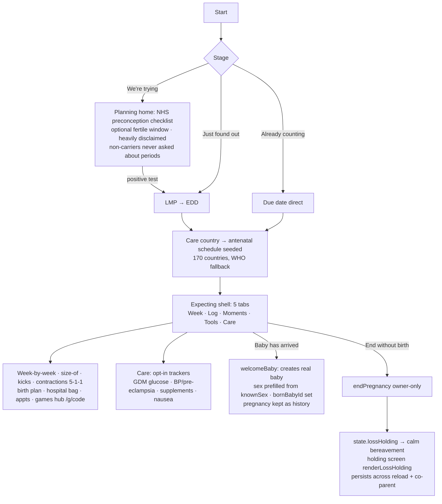

# Flow 07 — Pregnancy (trying → expecting → birth)

**Status: ✅ shipped & live · loss-flow discrepancy needs verification (L1) · nav restructure open (PV1/PV2)** · Files: `app/index.html` (3669–4903), `app/pregnancy-data.js`, `app/store-firebase.js` (privacy 511–655)

## Entry points
Onboarding stage chooser (Flow 02); `openStartPregnancy` from settings/baby sheet; planning→expecting conversion ("I got a positive test 🎉").

## Flow diagram

## Privacy model (owner-owned, server-enforced)
- Journey: `households/{hid}/pregnancy/{ownerUid}` + `pregShared[]` — members don't learn a pregnancy exists unless shared. Legacy in-blob journey self-migrates.
- Maternal health: `mhealth/{ownerUid}/cat/{category}`, per-category `sharedWith` allowlist. **Mood/EPDS owner-only forever — rule-enforced, never shareable.**

## Break points
| Condition | Behavior | Ref |
|---|---|---|
| Non-carrier viewer (Papa/Grandpa) | Never asked about periods (`viewerIsCarrier`) | index.html:3911 |
| Loss | `lossHolding` calm screen; suppresses upbeat chooser | index.html:3651–3666 |
| End pregnancy, keep moments | Optional archive to `state.pregnancyArchive` | index.html:4820 |
| Games hub backend absent | "Online sharing is coming soon 🤍" fallback | index.html:4256 |
| Mode switch | `openBabySheet` lists pregnancy row + babies; `viewingPreg` toggles shell | index.html:2666 |

## Expected vs actual
| Expected (source) | Actual | Status |
|---|---|---|
| One lifecycle, start anywhere (PREGNANCY-HANDOFF-V2 §2) | 3 entries + conversion | ✅ |
| 170-country antenatal (HANDOFF) | `PREG_COUNTRY_OPTS` + searchable full list (PREGNANCY.md's uk/us/de/uae list is stale) | ✅ |
| Clinical trackers NICE/ACOG thresholds (V2 §2) | Shipped; source-accuracy re-verify still wanted (HANDOFF) | ⚠️ verify |
| **Loss flow: UX-ROADMAP L1 says "just toasts and drops back — charter violation"** | Code trace found a real `renderLossHolding` holding screen persisting across reload/co-parent | ⚠️ **discrepancy: L1 may already be fixed post-audit — verify & close, or roadmap tested a different path (e.g. planning-stage end)** |
| 5-tab pregnancy nav | Shipped; PV1 wants Moments demoted → 4 tabs; PV2 move games card to Tools | ⚠️ open P1+ |
| Guess never becomes medical `b.sex` (GENDER-GAME-SPEC) | Only `knownSex` prefills birth picker | ✅ |

## Open items
Verify L1 status (highest moral priority per roadmap), PV1/PV2 nav, F1 split "we're trying" setup, N1 loss-safe mode switch, GDM/BP threshold source re-check.
