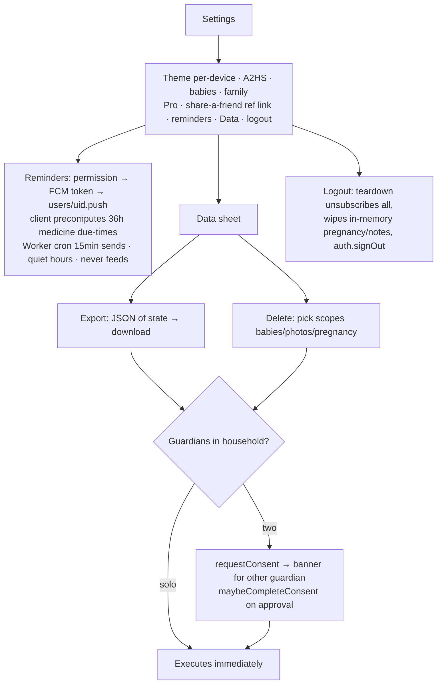

# Flow 08 — Settings, reminders, export & delete

**Status: ✅ shipped · consent gate is client-only (known gap) · export omits photos** · Files: `app/index.html` (settings 3308–3616, push 3229–3308)

## Flow diagram

## Break points
| Condition | Behavior | Ref |
|---|---|---|
| Push unsupported browser | Shows "coming soon" — actually means "unsupported here" (copy bug) | index.html:3235 |
| Consent pending | Banner surfaces request; other guardian must approve | index.html:3554 |
| **Consent enforcement** | **Client-only** — any member can still write the app blob; not in firestore.rules | PRIVACY-MAX known gap 🔴 |
| **Export contents** | `JSON.stringify(state)` only — **photo binaries not included** (live in PhotoStore), only references | index.html:3390 ⚠️ |
| Guardian errors | `window.alert` — inconsistent with custom sheet UI | polish |

## Expected vs actual
| Expected (source) | Actual | Status |
|---|---|---|
| Dual-guardian consent for export/delete (V2 §2) | Shipped app-level; copy softened to "Cubby asks…" | ⚠️ rules gap open |
| "Export/delete anytime" (LAUNCH positioning) | Export misses photos — weakens the claim; fix before privacy-wedge launch | ❌ |
| Medicine-dose push only, quiet hours (v0.14.0) | Shipped; `CUBBY_VAPID` set; cron healthy (live check: ageMin 14) | ✅ |
| Referral link in Settings (README §5) | djb2 `refCode` | ✅ |

## Open items
Move consent gate into firestore.rules; include photos in export (or label export honestly); fix "coming soon" vs "unsupported" copy; replace alert/confirm with sheets.
