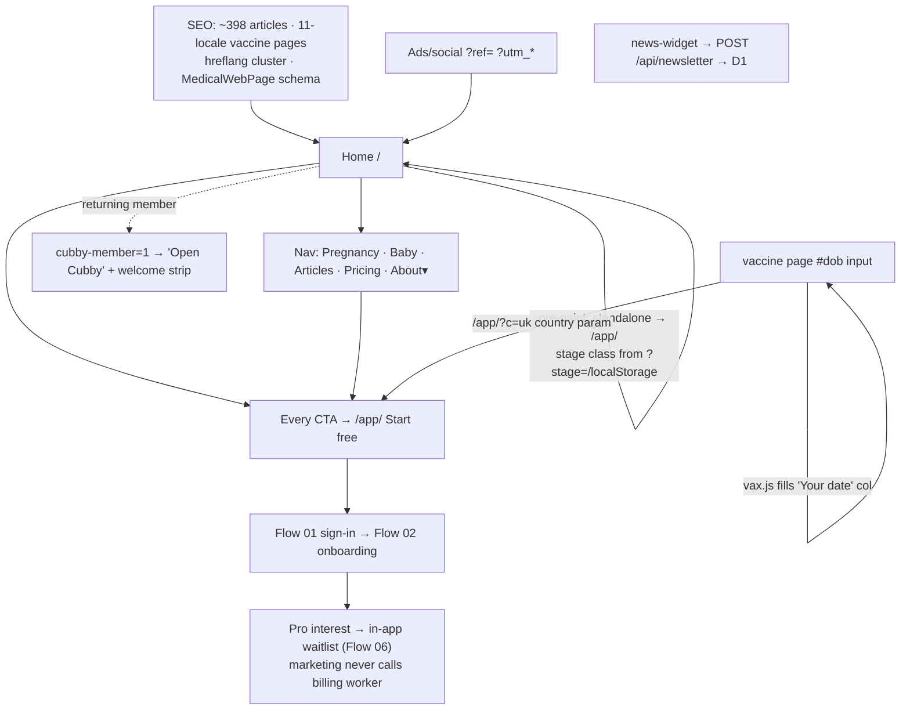

# Flow 10 — Marketing funnel & edge

**Status: ✅ shipped · 🔴 production /pricing/ is a stale build (verified live 2026-07-12)** · Files: root `index.html`, `pricing/`, `features/`, `faq/`, `vaccination-schedule/*`, `worker.js`, `news-widget.js`, `rail.js`, `install.js`, `vax.js`

## Funnel diagram

## Edge worker routing (order)
`POST /api/send-signin-link` → `POST /api/newsletter` → `GET /api/health` → `/api/game/*` → `/api/hub/*` → `/g(/*)` → `/__/*` proxy to firebaseapp.com → static assets. Cron: medicine push every 15 min (health check verified live: `cronHealthy:true`).

## Attribution (no third-party trackers, by design)
`?ref=` → `localStorage['cubby-ref']`; first-touch `utm_*` → `cubby-acq`; stamped onto Firestore user/waitlist docs inside /app/. Analysis is **offline**: `tools/analytics.js` (reach/activation/wedge) + `tools/funnel.js` (leaky bucket: signed-in → baby → logged → returned → sticky). The marketing site fires zero client events; newsletter POST is the only network call.

## Expected vs actual
| Expected (source) | Actual live (2026-07-12) | Status |
|---|---|---|
| 4-tab nav + About dropdown, ~395 pages (v0.14.0) | Home ✅ live | ✅ |
| One tier $9/$90, Aug 2026 badge (pricing banner) | **Live /pricing/ AND /faq/ = OLD builds: 5-tab nav, $15/mo·$179/yr ($15–19/mo in FAQ), FAQ claims pregnancy "is on the way" though it's shipped and marketed live.** Home/features/pregnancy/vaccine pages are current. Local branch `site` unpushed/partial deploy | 🔴 deploy drift (2 pages confirmed; re-sweep after deploy) |
| Home pricing section $9/$90 Aug 2026 | ✅ live matches repo | ✅ (inconsistent with live /pricing/ — visible to users) |
| Vaccine pages: dob calculator, `?c=` country param, official sources (README §10) | UK page live ✅ (2026 NHS changes, GOV.UK cited) | ✅ |
| Pricing JSON-LD offers monthly + annual | Only Free + annual $90 in JSON-LD; monthly in prose | ⚠️ minor SEO |
| Pregnant-visitor hero bridge (UX-ROADMAP M1, P1) | Fine-print link only | ❌ open |
| CTA wording standardized; Why/How-it-works out of dropdown; single Free-vs-Pro source (M2–M5) | Not yet | planned |
| news-widget doc says "Firestore" | Worker writes to D1 `NEWSLETTER_DB` | ⚠️ doc drift |

## Open items
**Deploy the current pricing page (user-visible price contradiction: home says $9, pricing says $15).** M1 hero bridge. JSON-LD monthly offer. M2–M5.
